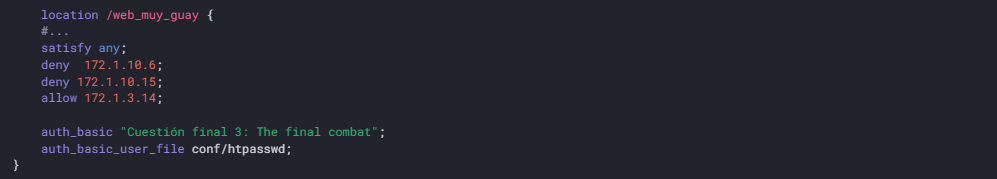
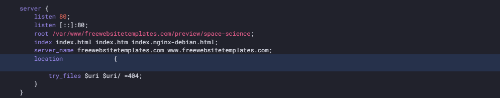

# PRÁCTICA 2.2: Autenticación en Nginx

## Instalación de paquetes necesarios

Comprobamos que la herramienta openssl está instalada:


En mi caso esta venía instalada por defecto, si no lo estuviera solo habría que instalarla

## Creación de usuarios y contraseñas

Creamos un archivo oculto ".htpasswd"  donde guardar usuarios y contraseñas, y añadimos nuestro primer usuario "manuel":


Y a continuación añadimos una contraseña cifrada para este:


He creado dos usuarios, y voy a comprobar si ambos han sido creados y con clave cifrada:


## Configurando el servidor Nginx para usar autenticación básica

Utilizaremos la directiva auth_basic dentro del location y le pondremos el nombre a nuestro dominio que será mostrado al usuario al solicitar las credenciales. Por último, configuramos Nginx para que utilice el fichero que previamente hemos creado con la directiva auth_basic_user_file :


```
Comprobación 1

Comprueba desde tu máquina física/anfitrión que puedes acceder a http://nombre-sitio-web y que se te solicita autenticación
```


```
Comprobación 2

Comprueba que si decides cancelar la autenticación, se te negará el acceso al sitio con un error. ¿Qué error es?
```


Nos da error 401, que es un código de estado HTTP que significa "No autorizado". Esto indica que la solicitud realizada por el cliente no tiene credenciales de autenticación válidas o que las credenciales proporcionadas no tienen permiso para acceder al recurso solicitado.


### Tarea 1

- Intenta entrar primero con un usuario erróneo y luego con otro correcto. Puedes ver todos los sucesos y registros en los logs access.log y error.log

- Adjunta una captura de pantalla de los logs donde se vea que intentas entrar     primero con un usuario inválido y con otro válido. Indica dónde podemos ver los errores de usuario inválido o no encontrado, así como donde podemos ver el número de error que os aparecía antes

Registro de acceso:


Registro de errores:


## Combinación de la autenticación básica con la restricción de acceso por IP

- Permitir o denegar acceso sobre una IP concreta (directivas allow y deny, respectivamente). Dentro del block server o archivo de configuración del dominio web, que recordad está en el directorio sites-available:
  


El acceso se garantizará ala IP 192.168.1.219/24, excluyendo a la dirección 192.168.1.220.

La directiva deny all denega el acceso a todo el mundo. 

- Combinar la restricción IP y la autenticación HTTP con la directiva satisfy.


Si establecemos el valor de la directiva a “all”, el acceso se permite si el cliente satisface ambas condiciones (IP y usario válido). Si lo establecemos a “any”, el acceso se permite si se satisface al menos una de las dos condiciones.

## TAREAS

### TAREA 1
Configura Nginx para que no deje acceder con la IP de la máquina anfitriona al directorio raíz de una de tus dos webs. Modifica su server block o archivo de configuración. Comprueba como se deniega el acceso:
- Muestra la página de error en el navegador

- Muestra el mensaje de error de error.log

Denegamos el acceso a nuestra ip:


Comprobamos el navegador:


Y por último el registro de error:


### TAREA 2
Configura Nginx para que desde tu máquina anfitriona se tenga que tener tanto una IP válida como un usuario válido, ambas cosas a la vez, y comprueba que sí puede acceder sin problemas

Permitimos acceso a nuestra ip y activamos la solicitud de autorización:


E introducimos las credenciales en el navegador:


## CUESTIONES FINALES

### CUESTIÓN 1
Supongamos que yo soy el cliente con la IP 172.1.10.15 e intento acceder al directorio web_muy_guay de mi sitio web, equivocándome al poner el usuario y contraseña. ¿Podré acceder?¿Por qué?


```
No se podrá acceder, ya que al haber configurado la opción "satisfy all", estás exigiendo que se cumplan ambas condiciones: que la IP esté permitida y que la autenticación sea correcta.
```

### CUESTIÓN 2
Supongamos que yo soy el cliente con la IP 172.1.10.15 e intento acceder al directorio web_muy_guay de mi sitio web, introduciendo correctamente usuari y contraseña. ¿Podré acceder?¿Por qué?


```
Si ingresas el usuario y la contraseña correctos, podrás acceder al sitio porque cumples con ambas condiciones: la autenticación es válida y tu IP está autorizada.
```

### CUESTIÓN 3
Supongamos que yo soy el cliente con la IP 172.1.10.15 e intento acceder al directorio web_muy_guay de mi sitio web, introduciendo correctamente usuario y contraseña. ¿Podré acceder?¿Por qué?



```
En este caso, con "satisfy any", aunque tu IP esté bloqueada, no podrás acceder a la web porque se está aplicando una restricción de IP que tiene prioridad.
```

### CUESTIÓN 4
A lo mejor no sabéis que tengo una web para documentar todas mis excursiones espaciales con Jeff, es esta: Jeff Bezos y yo

Supongamos que quiero restringir el acceso al directorio de proyectos porque es muy secreto, eso quiere decir añadir autenticación básica a la URL:Proyectos

Completa la configuración para conseguirlo:



```
server {
    listen 80;
    listen [::]:80;
    root /var/www/freewebsitetemplates.com/preview/space-science;
    index index.html index.htm index.nginx-debian.html;
    server_name freewebsitetemplates.com www.freewebsitetemplates.com;
    location /proyectos {
        auth_basic "Proyectos secretos";
        auth_basic_user_file /etc/nginx/.htpasswd;
        try_files $uri $uri/ =404;
    }
}
```